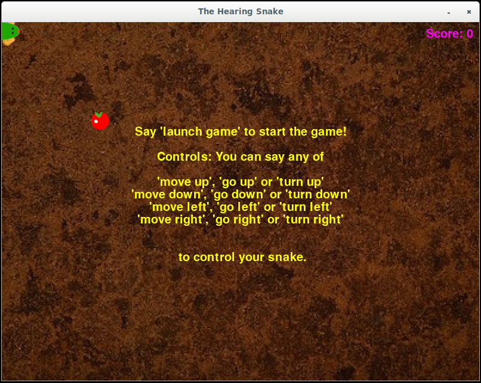

# Coral Keyphrase Detector

*Kevin Kilgour (kkilgour@google.com), Google Research*<br>
*Duc Dung Nguyen (ddung@google.com), Google Research*<br>
*Sarah Amsellem (samsellem@google.com), Google Research*<br>
*Dominik Roblek (droblek@google.com), Google Research*<br>
*Michael Tyka (mtyka@google.com), Google Research*<br>


A keyphrase detector, often referred to a keyword spotter (KWS) is a simple speech processing application that
detects the presence of a predefined word or short phrase in stream of audio.
This is commonly encountered nowadays with *hotwords* (or wake words) such as *"OK Google"* or *"Alexa"* that
are used by digital assistants to tell them when to start listening.

The repo contains a keyphrase detection model that can detect about 140 short keyphrases such as
*"move left"*, *"position four"* in a two second window of audio. Each output neuron of the neural network
corresponds to a keyphrase, the full list can be found
 [here](config/labels_gc2.raw.txt).

The repo also contains all the necessary wrapper code and three example programs:
  * run_model.py: Prints out the top couple of detections each time inference is performed,
  * run_hearing_snake.py: Launches a simple voice controlled version of the game snake.
  * run_yt_voice_control.py: Allows you to control a YouTube player. Requires YouTube to be running in a
    browser tab and focus to be on the YouTube player.


##  Quick Start
Make sure you've got your Edge TPU device is correctly configured. If you encounter any problems with the model please ensure that you are running the latest version:
  * For [Coral DevBoard](https://coral.withgoogle.com/docs/dev-board/get-started/#update-the-mendel-software)
  * For [USB Accelerator](https://coral.withgoogle.com/docs/accelerator/get-started/#set-up-on-linux-or-raspberry-pi)

To install all the requirements, simply run.
```
sh install_requirements.sh
```
On both the Coral DevBoard and USB Accelerator the model can be tested by executing:
```
python3 run_model.py
```
After a couple of seconds the following output should be visible:
```
$ python3 run_model.py
ALSA lib pcm.c:2565:(snd_pcm_open_noupdate) Unknown PCM cards.pcm.rear
...
ALSA lib pcm_usb_stream.c:486:(_snd_pcm_usb_stream_open) Invalid type for card

Input microphone devices:
  ID:  0  -  HDA Intel PCH: ALC285 Analog (hw:0,0)
  ID:  6  -  sysdefault
  ID:  12  -  lavrate
  ID:  13  -  samplerate
  ID:  14  -  speexrate
  ID:  15  -  pulse
  ID:  16  -  upmix
  ID:  17  -  vdownmix
  ID:  19  -  default
Using audio device 'default' for index 19
        negative (0.988)
        negative (0.996)
        negative (0.996)
        negative (0.996)
        ...
```

Say some of the keyphrases the model can understand and you should see them being recognized.
```
       negative (0.973)              no (0.020)
*launch_application* (0.996)
*launch_application* (0.996)
*launch_application* (0.996)
*launch_application* (0.996)
        negative (0.914) begin_application (0.039) open_application (0.016)
        negative (0.996)
        negative (0.562)    position_two (0.254)    position_one (0.113)
*      move_left* (0.996)
*      move_left* (0.996)
*      move_left* (0.996)
        negative (0.938)      turn_right (0.016)       turn_left (0.016)
        negative (0.863)      turn_right (0.035)       last_song (0.035)
*      volume_up* (0.996)
*      volume_up* (0.996)
*      volume_up* (0.996)
*      volume_up* (0.984)     volume_down (0.008)        negative (0.008)
```

The default display class shows up to the top 3 detections with their confidences.
If something isn't working as expected then check out the troubleshooting section
below before trying the other examples.

### Hearing Snake
Hearing snake is a version of the classic snake game that can be controlled
using voice commands. It requires a display, so if you're using the Coral DevBoard
attach a monitor first.



If you have the **USB Accelerator** plugged into a Linux system with an X windows system with simply run:
```
python3 run_hearing_snake.py
```
On the **Coral DevBoard** run:
```
bash run_snake.sh
```
A game window should appear with instructions on how to play.

### YouTube Voice Control
YouTube Voice Control demonstrates how voice commands can be used to control other applications. Begin by opening YouTube in a browser and playing a video or playlist. Again this requires a display so if you're using the Coral DevBoard attach a monitor before trying it.

If you have the **USB Accelerator** plugged into a Linux system with an X windows system with simply run:
```
python3 run_yt_voice_control.py
```
On the **Coral DevBoard** run:
```
bash run_yt_voice_control.sh
```
If you say a command that is relevant to YouTube like *next song*, *next video* or *mute* then you should see the detection appear in the console.
```
next_video {'key': 'shift+n', 'conf': 0.4}
---------------
next_song {'key': 'shift+n', 'conf': 0.4}
---------------
mute {'key': 'm', 'conf': 0.4}
---------------

```
Once you switch focus back to the YouTube video player (e.g. Alt+tab or click on it) you will notice that these commands are acted upon and control the YouTube video player.
This is done by mapping the detentions to a virtual key press and can be configured to support many different applications.

## Under the Hood
The keyphrase detection model requires an input of two seconds of audio converted to [32 dimensional log mel features](https://en.wikipedia.org/wiki/Mel-frequency_cepstrum).  These features are computed every 10 ms which means that two seconds of audio results in 198 feature vectors or frames.
The model wrapper keeps a buffer of the last 198 frames and runs it through the model every *N* frames. By default *N* is set to *33* but it can be changed using the *--num_frames_hop* parameter.
Compare
```
python3 run_model.py --num_frames_hop 11
```
and
```
python3 run_model.py --num_frames_hop 99
```
Using a lower value for *num_frames_hop* results in the model performing inferences more often, reducing its latency but also increasing the computational cost.

### Controlling the key mapping
The YouTube voice control example uses [PyUserInput](https://pypi.org/project/PyUserInput/) to simulate keyboard presses. A mapping between voice commands and keys can be found in config/commands_v2.txt.
```
volume_down,down,
next_song,shift+n,
```
This maps the command *volume_down* to the *down* key and the command *next_song* to pressing both the *shift* key and the *n*.  Try adding a new mapping (config/labels_gc2.raw.txt contains a list of valid voice commands).

### More fine grained control
You can more finely control how and if to react to voice commands by writing a new callback function.


## Troubleshooting

 ### Problem 1: It's failing with this error "*OSError: \[Errno -9997\] Invalid sample rate*.
 Possible Solution: Have a look at the program output for a list of microphones. It should look something like this:
```
Input microphone devices:
  ID:  0  -  HDA Intel PCH: ALC285 Analog (hw:0,0)
  ID:  6  -  sysdefault
  ID:  12  -  lavrate
  ID:  13  -  samplerate
  ID:  14  -  speexrate
  ID:  15  -  pulse
  ID:  16  -  upmix
  ID:  17  -  vdownmix
  ID:  19  -  default
Using audio device 'default' for index 19
```
 Use the "--mic X" option to select the correct microphone. The model expects an input at a sample rate of 16kHz.
If you want to use a microphone that doesn't support 16kHz then use the "--sample_rate_hz XXXXX" option and force the sample rate to be something youe microphone suports. If you choose 48000 then it will automatically be downsampled to 16000.
All other inputs may not work correctly.

### Problem 2: The detection quality is very bad.
Possible Causes:
  *   Wrong microphone selected, see Problem 1.
  *  System microphone gain set too high, or to low. Have a look a your system's sound setting for input devices and check that its gain is high enough for normal speech to reach a reasonable level but not to high that often *peaks* (reaches the maximum).
  * Poor or broken microphone, try another microphone.
  * Too much background noise, use a close speaking microphone.

###  Problem 3:  The model works well on some keyphrases but not on others.
This is a known problem and future versions will try and remedy this.
Some keyphrases are are harder to detect than other and not everyone speaks the same accent.
There are two models in the models directory. By default *voice_commands_v0.7* is used. Try the *voice_commands_v0.8*, epecially if you are having trouble with the *o'clock* keyphrases.
```
python3 run_model.py  --model_file voice_commands_v0.8_edgetpu.tflite
```

### Problem 4:  The model is over-triggering on a keyphrase.
Use a keyphrase specific threshold. For the snake example this can be done in the config/commands_v2_snake.txt file by adding it to the end of the relevant line; e.g. <br>
  ```
go_left,left,0.9
go_right,right,0.7
  ```
would set the keyphrase specific threshold of *go_left* to *0.9* and of *go_right* to *0.7*.

### Problem 5: I need a keyphrase that is not provided by the model.
For now we only have [these ca 140 words](config/labels_gc2.raw.txt), however in future version we wish to supply many different possible combinations of keyphrases. Please send feedback on what would be useful.


